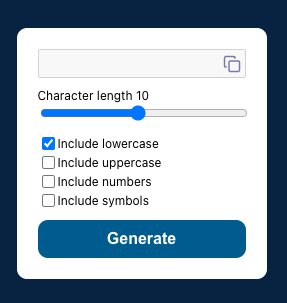

In the project directory, you can run:

### `npm start`

Runs the app in the development mode.\
Open [http://localhost:3000](http://localhost:3000) to view it in your browser.

### `npm test`

Launches the test runner in the interactive watch mode.\
See the section about [running tests](https://facebook.github.io/create-react-app/docs/running-tests) for more information.

## This project contains a password generator

You are able to generate a password from 1 to 20 characters that can be defined in the range input.
By default, include lowercase is defined, but you can select any other option. You always need to have one option selected so in case you try to unselect the only checkbox selected you will not be able to do it.
After generating the password copy button will be enabled, and once you click it the password will be available to paste.

If you aren't satisfied with the build tool and configuration choices, you can `eject` at any time. This command will remove the single build dependency from your project.

Instead, it will copy all the configuration files and the transitive dependencies (webpack, Babel, ESLint, etc) right into your project so you have full control over them. All of the commands except `eject` will still work, but they will point to the copied scripts so you can tweak them. At this point you're on your own.

You don't have to ever use `eject`. The curated feature set is suitable for small and middle deployments, and you shouldn't feel obligated to use this feature. However we understand that this tool wouldn't be useful if you couldn't customize it when you are ready for it.

### Packages used

- React
- React testing library
- clsx
- styled-components
- lucide-react
